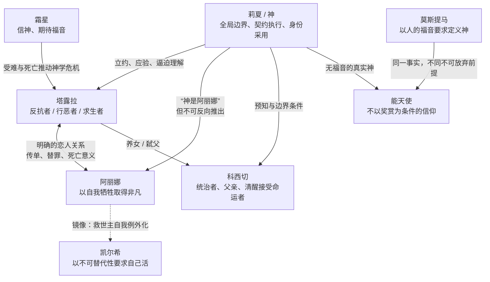

# 《源石与神灵》详细评估：从第一卷成稿出发看整部长篇的结构、人物、思想与文学潜力

**执行摘要：**以目前真正达到“成稿”完成度的第一卷前段，尤其是 **1-1 至 1-5** 为主要证据，我对《源石与神灵》的总体判断相当明确：**这不是一部“点子很多但文学性不足”的小说，恰恰相反，它已经形成了相当鲜明而且难以替代的文学机制；它目前最强的并非单句华丽，而是“概念经由人物选择落地、物件经过剧情发生意义变质、叙事形式被世界规则反向侵入”这三种能力。**1-4.5 与 1-5 尤其证明，作者已经能够把神学、免疫学、官僚程序、爱情、资源分配和政治伦理压进同一条因果链，而不是仅仅把知识当装饰。真正需要警惕的，也不是你已经准备整体处理的“2-1式网络流行文风”，而是更根本的五件事：**其一，后两卷的概念增长速度明显快于剧情因果链的成熟速度；其二，人物越来越有变成思想命题载体的危险；其三，所有细节都太“有用”，会形成过度设计感；其四，神、程序、科学隐喻和元叙事若继续扩权，可能使任何事件都能事后合理化，从而削弱真正的戏剧约束；其五，后日谈的现实/幻觉歧义若控制不好，会把前三卷已经真实承担过的伦理代价重新虚化。**因此，将来大改时最大的收益不在逐句润色，而在于先把第二、三卷重新压成一条可追踪的“人物选择—权限变化—不可逆后果”链，再回头按1-1至1-5的成稿文风统一语言。原作和当前项目记忆本身也已经把“正式正文、成形草稿、情节点提纲”明确区分，并要求评价时不能混为一谈；以下报告遵守这一边界。fileciteturn0file1 fileciteturn0file2

## 评估边界与核心判断

### 本次分析采用的假设

| 假设 | 本报告的处理方式 | 对结论的影响 |
|---|---|---|
| 1-1至1-5基本代表未来目标文风 | **是。**其中尤其以1-1、1-4、1-4.5、1-5判断叙事语言、意象和形式 | 很大 |
| 1-6以后大量内容仍属草稿、笔记或结构方案 | **是。**主要评价其剧情功能、人物方向、思想结构，不以现有句子判最终文笔 | 很大 |
| 2-1一类网络流行文本、梗化表达以后会整体改掉 | **完全按你的要求忽略。**不会把它作为全书文学性或文风缺陷的主要证据 | 很大 |
| Codex memory 中作者后来确认的设定高于旧草稿和旧AI分析 | **是。**特别是“神是阿丽娜≠阿丽娜是神”、能天使的信仰逻辑、阿丽娜的非凡欲等 | 很大 |
| 《AI写作流分析》里的哥伦比亚战争等后续讨论属于未来方案而非已经落定的正文 | **是。**只评价其潜力和风险，不把它当既定剧情 | 中等 |
| 《明日方舟》原作人物与世界背景是读者已有的一层前理解 | **是。**但本报告主要检查本小说自身是否能建立独立的因果与人物逻辑 | 中等 |

这些边界与项目自己的创作规范基本一致：当前 memory 明确要求区分正式正文、成形草稿与情节点提纲，也把旧分析中“莉夏就是阿丽娜，从故事开头”等解释标为废止，不允许旧推论倒灌当前设定。fileciteturn0file2

### 我认为这部小说真正的“骨架”是什么

乍看之下，《源石与神灵》很容易被描述成：

> 神学 + 程序设计 + 生物医学 + 《明日方舟》 + 元叙事 + 身体恐怖。

但这仍然只是材料清单。

它真正统一这些东西的，不是“高维神”这个设定，而是一套反复出现的**权限语法**：

**谁提出要求 → 谁确认/批准 → 谁负责执行 → 谁真正理解 → 谁承担代价 → 谁有权解释结果。**

于是，完全不同的系统可以使用同一种句法：

神那里是“祈求—立约—应验”；

医院那里是“知情—同意—操作”；

乌萨斯那里是“申请—审批—执行—回收”；

教会那里是“神启—教义—信仰—献身”；

第三卷学术机构那里是“IRB—伦理许可—实验”；

管理员世界那里则是“权限—命令—任务—结算”。fileciteturn0file2

**这才是全书最值得保住的原创结构。**

也正因为如此，我认为这本书并不是“把一堆知识梗拼在一起”。在成功段落中，不同知识体系实际上已经被翻译成了一种共同的文学语法。

而它未来是否会真正成为一部长篇，而不是一串非常聪明的思想实验，关键就在于：

> **这套语法最后能否持续改变人物，而不只是持续解释世界。**

## 剧情结构与长线工程

### 第一卷前半已经形成了一条非常强的因果链

如果只看1-1到1-5，它其实已经接近一个自足的小型悲剧结构：

这条链最大的优点，是**后一个事件不是在“主题上呼应”前一个事件，而是真正被前一个事件训练出来的。**

1-4.5中，奶奶并不是因为“深爱孙女、主动为她节省口粮”而死。她已经接受了国家有机体的解释，认为自己作为衰老的“血”应该退出。阿丽娜无法承受这个事实，于是问塔露拉，奶奶是否因为爱她们、怕拖累她们才去死；塔露拉明知不实，却回答：

> “一定是的。”

小说随即补上一句：

> “全乌萨斯的风雪都知道她在撒谎。”

到了1-5，阿丽娜真的把这个解释当成了行动范型：**爱一个人，就是在危机到来时主动把自己从世界里删除，把罪、死亡和资源压力集中到自己身上。** fileciteturn0file1

这是一种非常好的伏笔。

因为它不是“前面出现一把枪，后面开枪”，而是：

> **前面种下一套错误伦理算法，后面人物亲自运行了它。**

这比常见的物件式伏笔更高级。

### 1-1的开篇结构也相当成熟

1-1已经直接告诉读者：

> “塔露拉的故事从现在开始讲，讲到科西切死。  
> 我们的故事也从现在开始讲，讲到阿丽娜死。”

这意味着作者主动放弃了两个最廉价的悬念：

**科西切会不会死？**

**阿丽娜会不会死？**

答案都提前给出。

后面真正悬着的是：

**他们为什么必然这样死？**

**哪条规则把人一步一步推到那个已经宣布的结果？**

**谁会以为自己是自由选择的？**

**死亡最后被谁解释、利用、占有？**

项目自己的剧情方法后来也明确把这种写法总结成“应验型叙事”：公开结果以后，把悬念转移到执行路径、执行者、代价和原句意义如何变化。fileciteturn0file2

这一点非常适合这部小说，因为它让“神的全知”和叙事形式成为同一个东西：

> **读者也像神一样提前知道结局，但读者并不知道路径。**

这不是一般意义上的倒叙，而是一种叙事层面的神学模拟。

### 1-4是形式实验最成功、同时也最接近饱和的一章

1-4里，小说世界开始通过文本自身表现故障：

`SAN_CHECK`；

人物退化成`{她}`；

世界像游戏只加载书房门附近区域；

跑了很久，门仍然在一步之外；

自杀无法生成符合结局边界条件的世界线；

科西切的死亡不再是普通因果结果，而像：

> “起点 + 终点 → 约束所有中间可行路径。”

而最后那个极小的门的动作——塔露拉一直想“向外走”，却不知道门要先向内拉——把宏大的“局部理性与全局路径”压缩成了一个物理动作。当前 Codex memory 也明确将它记录为人物局部优化与神的全局边界条件之间的核心模型。fileciteturn0file1 fileciteturn0file2

这是非常有效的形式文学。

但它也已经暴露了全书未来一个重要风险：

**1-4几乎每隔几段就要出现一次新型异常。**

数学；

程序；

TRPG；

经文；

贴图；

UI；

空间异常；

人称变换；

记忆清除；

时间循环；

边界条件。

单个看都能成立，但它们挤在一起以后，章节内部的“异常等级”开始趋平：

> 如果每一页都在违反世界规律，那么真正应该最震动读者的违反反而不再突出。

这不是要求把1-4写“正常”，而是要注意**奇观也需要层级**。

你以后整体大修时，最好不是问：

> 哪个点子不好？

而是问：

> **这一章究竟由哪两三种异常机制统治？其他异常是在辅助它，还是跟它争抢高潮？**

这是结构问题，不是文风问题。

### 1-4.5与1-5是目前全书结构完成度最高的连续两章

它们真正厉害的是建立了“重复但不重复”的结构。

1-4.5：

**老人被要求退出整体。**

1-5：

**年轻的阿丽娜主动要求替别人退出。**

1-4.5：

**国家将死亡包装为程序。**

1-5：

**阿丽娜将死亡包装为爱与羔羊。**

1-4.5：

**国家回收尸体。**

1-5：

**塔露拉拒绝别人共同解释阿丽娜的尸体。**

1-4.5：

**糖是制度奖励。**

1-5：

**糖变成阿丽娜身体的一部分，再变成塔露拉无法否认的共犯证据。**

因此这两章不是简单的“制度暴行 → 爱人遇害 → 主角黑化”。

它们实际上不断争夺：

> **一个人的死亡究竟属于谁？**

属于国家？

属于人民？

属于爱人？

属于死者自己？

属于神？

还是任何人都无权替死亡安排意义？

这个问题会自然连到后面的献祭、十字军、救世主、实验伦理和永生，因此它完全有资格成为全书的核心轴之一。fileciteturn0file1

### 后续最大的结构问题：概念已经抵达第三卷，剧情还没有

从现在的总纲看，第三卷已经拥有很多很强的终局构想：

源石全球网络；

感染者体内晶格作为终端；

全球控制；

遗忘之塔；

1024年龄溢出；

世界程序停摆；

管理员权限；

凯尔希的永生；

能天使的主动献祭；

登神仪式的自举闭环；

塔露拉最后向莉夏请求永生；

后日谈回到医院与近似原作现实。

单独看，每一个都有想象力。fileciteturn0file2

问题是：

**第三卷现在不像“一个高潮越来越不可避免”，而更像“七八个高潮已经在排队”。**

这会造成典型的长篇后期“机制通胀”：

第一卷用一扇门就能表达全局最优；

第三卷却可能需要管理员、SQL式权限、伽马射线、神经晶格、数值溢出、时间闭环、登神塔、异世界残留同时工作。

这不是因为后者“太复杂”，而是因为：

> **表达同样深度的思想所需的外部机械越来越大。**

这是一个需要警惕的信号。

好的长篇升级应该是**前面很小的规则不断扩大作用范围**，而不是每一卷重新引进更大的机器。

因此目前整书结构最高优先级，并不是补更多第三卷设定，而是检查：

**第一卷已经建立了哪些规则，足以不增加新规则地逼出第二卷？**

**第二卷哪些人物选择，必须实际建成第三卷的源石网络、战争结构和权力条件？**

当前 memory 对“大开采—全球贸易—源石基础设施—第三卷网络”已经开始做这种因果桥，这是正确方向。fileciteturn0file2

### 第二卷反而是当前最危险的“中空地带”

第一卷有非常强的私人悲剧因果。

第三卷有明确的终局机器。

第二卷目前最突出的是一系列很有力量的神学命题：

能天使作为施洗约翰式人物；

直接神启绕过教会；

莫斯提马坚持“真神应当带来福音”；

能天使则因为确认莉夏确实是神，反过来放弃“神必须给予福音”的教义；

最后走向十字军与献祭。fileciteturn0file2

其中最有力的核心句，实际上已经很清楚：

> “你信神是为了得福音，我信神是因为神就在那里。”

问题是，**一句非常好的神学冲突不是一卷小说。**

第二卷现在最需要解决的是：

> **信仰变化怎样实际改变战争、组织、物流、经济、源石传播以及人物关系？**

否则就会成为：

思想场景A → 神学对话B → 战争奇观C → 信仰场景D → 十字军E。

每场都聪明，但它们之间不是“上一场逼出下一场”。

而1-4.5到1-5已经证明，这位作者真正强的时候恰恰是：

> **思想不是下一场被讨论，而是下一场被执行。**

第二卷应该达到同样标准。

## 人物弧与关系网络

从人物结构看，目前真正支撑全书的不是“主角塔露拉和反派莉夏”，而是几种不同的**自我例外化方式**互相照镜子。

这张关系网最有意思的地方，是多数人物并不是传统的“价值立场一人一个”。

他们真正不同的是：

> **当两个原则不能同时保住时，每个人究竟不肯放弃什么。**

这与项目当前 character-craft / thought-expression 的总结也是一致的。fileciteturn0file2

### 塔露拉是当前最完整的人物

她之所以成立，不是因为经历很多，而是她一直在重复一种非常稳定的欲望：

> **我要自己决定。**

她要自己决定成为感染者；

自己决定杀科西切；

自己决定是否接受命运；

自己决定革命；

自己决定阿丽娜的死亡意义；

自己决定谁有罪；

后来又会面对自己是否愿意死亡的问题。

于是1-4最残酷的地方，不只是“命运强迫她杀父”，而是：

> **它攻击的是塔露拉最核心的自我定义——我做的事必须是我自己选择的。**

因此她宁可自杀，也不愿在那个时刻杀科西切。

同样，1-5屠村也不是人格突然崩坏。

她此前坚持普遍主义：

> 感染者也是人；
> 每个人的生命不该因效用而被牺牲。

可是阿丽娜死后，她突然发现：

> “其他人可以进台账，奶奶也可以。阿丽娜不行。”

再进一步：

> “所有人都是平等的，但阿丽娜更平等。”

于是她并非单纯“失去理智”，而是在私人爱情面前发现自己的普遍主义无法贯彻到底。fileciteturn0file1

这使屠村有真正的人物逻辑。

它既不正当，也不随机。

### 塔露拉未来最危险的地方，是弧线太“工整”

从现有总纲看，她未来还要经历：

弑父；

失去阿丽娜；

杀村民；

杀/失去霜星；

失去爱国者；

革命；

源石大开采；

与神共谋；

批判长生者；

最后因死亡恐惧向莉夏求永生。fileciteturn0file2

最后那一步其实非常好。

因为它不是“塔露拉变坏”，而可能是：

> **她花了一辈子建立的思想身份，最后败给了肉体最原始的求生欲。**

这会比“她终于意识到自己的理论错误”强得多。

但前提是，不能把它写成一个作者提前准备好的讽刺句号：

> 看，你以前骂长生种，最后自己也怕死。

这样太容易。

真正成熟的版本应该让读者在她跪下求永生以前就已经感到：

> **她很可能会求。**

同时又仍然希望：

> **她千万不要。**

这才是悲剧。

因此塔露拉后续需要的不是更多观点变化，而是更多**身体、损失、羞耻、依恋和恐惧持续侵蚀她的自我叙事**。

这是人物弧问题，不需要额外新增哲学。

### 阿丽娜比“圣女”复杂得多，而且这是正确方向

当前项目 memory 已经明确否定一种过度美化的理解：

阿丽娜当然真心爱塔露拉；

也真心希望村民获救；

但她的自我牺牲同时满足了一种非常深的欲望——

> **只有我来承担。**

她喜欢把自己放在：

“村子的羔羊”；

“替所有人承担的人”；

后来甚至是“我就是神、所有罪都是我的”

这种位置上。fileciteturn0file2

这非常重要。

因为1-5如果只是：

> 纯洁少女为了爱人无私赴死，

其实并不复杂。

但如果是：

> 她爱人、爱村民，同时也必须让自己成为那个最特殊的、唯一能够承担所有人的人，

那么她的“无私”内部就包含了一个极强的自我中心。

而且这种自我中心不是“她其实很自私”的廉价反转。

恰恰相反：

> **她越真诚地为别人牺牲，这种需要成为唯一承担者的欲望才越有力量。**

于是她和凯尔希的对照就很漂亮：

阿丽娜：

> 为了所有人，我必须死。

凯尔希：

> 为了所有人，我绝不能死。

表面相反。

深层却都是：

> **只有我承担着别人无法承担的世界责任。**

这比单纯把二人安排成“无私者/自私者”高级很多。当前人物记忆也明确把二者定义为救世主式自我例外的镜像。fileciteturn0file2

### 阿丽娜与塔露拉的爱情目前写得最好的地方，是“不把爱情单独拿出来写”

这两人的关系是明确的恋人关系，当前项目记忆已经对此做了确认，不应再误读成“其实只是身份、文字或罪责关系”。fileciteturn0file2

但正文里最好的一些爱情表达恰恰没有直接告诉读者：

> 她很爱她。

比如传单。

阿丽娜从塔露拉的宣传文字里留下了一张：

> “不为主义，只因为那是塔露拉的字。”

然后这个物件继续变形：

**政治宣传品 → 私人保存物 → 犯罪证据 → 身份替代工具 → 阿丽娜替塔露拉认罪的媒介。** fileciteturn0file1

这比直接称它“情书”强很多。

当前 style memory 也已经把“当情书收着”列为待删的负面样本，理由并不是反对爱情，而是“情书”这个现成类型标签过早替物件规定了意义。fileciteturn0file2

这是很正确的判断。

**两人的爱情最有价值的不是甜度，而是她们不断把对方的文字、罪、死亡和身份拿到自己身上。**

因此未来大改中，我反而不建议“补爱情戏”作为目标。

真正要检查的是：

> 两个人彼此究竟改变了哪些决定？

如果爱情能改变行动，它已经成立。

### 莉夏/神是极强的角色，同时也是全书最大的技术风险

莉夏最可怕的时候，不是展示力量的时候，而是非常温和地执行别人自己的要求。

比如：

> “向我求，我就应你。”

> “立下的约，凡事都成。”

她不需要表现“恶意”。

她只需要：

**准确。**

这让她和普通“邪神”拉开了距离。

她更像：

神；

程序解释器；

叙事者；

契约执行器；

作者权限；

同时又拥有人的身份和亲密关系。fileciteturn0file1 fileciteturn0file2

但是这种角色最容易毁掉小说。

因为只要读者形成：

> “反正莉夏什么都能做，发生什么都是她安排的。”

那么剧情就失去真正的约束。

届时任何漏洞都可以解释成：

> 神故意的。

任何巧合都可以解释成：

> 高维因果。

任何人物选择都可以解释成：

> 她被神推动。

**一个无法被反证的世界规则，在文学上其实等于没有规则。**

因此莉夏必须同时保持两种性质：

**对人物而言不可理解；**

**对重读者而言可审计。**

读者第一次可以不知道她为什么这么做，但第二次读应该能够发现：

> 原来她一直没有违反那个约；

> 原来那个结果早就成为边界条件；

> 原来她能做A但没有直接做B；

> 原来她必须借人物的请求获得某种叙事接口。

也就是说：

> **神秘不能等于任意。**

这可能是全书世界观最重要的一条技术纪律。

### 科西切是第一卷很值得保留的“反直觉人物”

1-2一开始把他包装成典型的：

“腐朽贵族”；

“阴险残忍的毒蛇”；

“坏父亲”。

然而越到1-4，越发现他不是只承担这个功能。

他知道塔露拉要杀自己；

知道命运不可反抗；

甚至提前准备自己的死亡；

面对女儿的结局，真正担忧的是代价是否落到她身上；

塔露拉最后杀死他以后，在心里叫出：

> “父亲。”

这就使他变成了一个很有意思的伦理干扰项。fileciteturn0file1

他的复杂不应该被误解成“洗白”。

真正有价值的是：

> **一个政治上可能残酷的人，私人关系仍然可以真诚；一个理解命运的人，也可能比反抗者更清醒。**

如果后续整部小说完全不再利用这一层，那么1-4会成为一个局部很精彩、却没有进入塔露拉长期人格的复杂性。

更理想的是把它保留为她后续判断别人的隐性伤口：

> 她曾经杀过一个自己误以为完全理解、后来才发现从未理解的人。

这会天然服务你全书后来“理解之后才谈承担”的主轴。

### 次要人物目前最普遍的问题：太容易成为思想的接口

霜星、能天使、莫斯提马、凯尔希都有很强的思想位置。

这本身不是问题。

真正的问题是，如果读者总能预测：

> **这个人一出场，就是为了让某个哲学命题运行。**

人物就会越来越像函数。

这部小说目前有一种很明显的工程倾向：

**每一句有功能；**

**每一个物件会回收；**

**每一个人物承担观点；**

**每一场戏推进主题。**

从写作工程上看，这是效率极高。

从文学上看，却需要一点“无用”。

真人会有：

没有主题价值的趣味；

不高尚也不邪恶的坏习惯；

错误记忆；

微不足道的偏爱；

跟全书哲学没有关系的羞耻；

不知道最后会不会回收的小愿望。

这里的“无用”不是让小说灌水，而是让人物产生一种：

> **她在作者没有观察她的时候也会生活。**

尤其第二、三卷人物数量增加以后，这是非常重要的抗工具化手段。

## 世界观、制度与思想内核

### 1-4.5的免疫学映射不是装饰，而是这部小说非常关键的一次思想升级

1-4.5把国家和身体建立了非常完整的结构关系。

NK式纠察队；

MHC-I身份证明；

IL-15酒壶；

程序性死亡；

“eat me”回收标记；

资源不足下的AMPK语义；

有异常反应倾向的执法者自己也受到内部清除。

当前记忆甚至细分了NK的`missing self`和杀手T细胞读取具体呈递内容的不同识别算法，并要求生物学隐喻必须映射操作链而非只玩术语。fileciteturn0file2

所以这里真正提出的问题不是：

> “乌萨斯很坏，像冷酷的免疫系统。”

而是：

> **为什么免疫系统在身体内是维持生命，在国家里却可能成为暴政？**

答案不能简单是“因为残酷”。

因为细胞凋亡本来就是正常生命的一部分。

真正发生变化的是**主体尺度**。

在人体中，我们默认：

> 人是主体，细胞是组成单位。

乌萨斯政治哲学却悄悄改成：

> 国家才是主体，人只是组成单位。

所以奶奶才能说：

> “长生的老爷们是国家的心脏，我们是乌萨斯的血。心死了乌萨斯也会死，血不换国家就要腐烂。”

只要接受“乌萨斯是那个真正的生命”这个前提，后面的很多残酷行为反而会显得高度合理。fileciteturn0file1

这非常有价值。

因为它没有让政治问题停留在“坏制度压迫好人”。

它直接追问：

> **谁才有资格成为伦理上的最终主体？**

个人？

家庭？

社会？

国家？

人类？

生态系统？

每提升一级，下面的主体都可能被重新解释成“局部”。

### 但这个隐喻也有一个极高风险：科学事实不能偷偷替政治伦理背书

这里必须特别谨慎。

可以拆成三层：

**描述层：**

多细胞生物确实需要通过细胞死亡、免疫清除和稳态维持整体。

**政治类比层：**

国家可以被类比成一个有机体，机构对应免疫机制，公民对应细胞。

**伦理推论层：**

所以国家有权像身体处理细胞一样处理人。

第三层**不能由前两层自动推出**。

否则作品本来非常尖锐的隐喻，会滑向一种“自然就是如此，所以政治也应如此”的天然化。

也就是说，这套免疫学设定最好的文学用途，不是证明乌萨斯“其实科学上是对的”，而是逼迫读者承认：

> **仅靠生物学根本无法解决伦理问题，因为生物学不会告诉我们谁应该被当成最终主体。**

这正是你此前围绕“那癌细胞是不是反抗英雄”的追问能够成立的原因。

### “制度反对的不是残酷，而是未经批准的残酷”是目前最有潜力贯穿全书的思想轴

这句话在当前 memory 中已被明确记录为全书主轴之一，而且也特别注明：

> **得到批准，并不使恶成为善。** fileciteturn0file2

第一卷已经把它写得很清楚：

国家可以批准老人死亡；

可以批准成年净化；

可以批准遗体回收；

而一名军官即使还没有真正非法杀人，只因他表现出超出授权范围的杀伤倾向，就可能遭到内部清除。

所以制度真正维护的不是：

> 不要杀人。

而是：

> **只有正确的人可以在正确权限下杀正确的人。**

这非常强，因为它把道德轴换成了权限轴。

第三卷IRB、伦理批准、管理员权限完全可以继续这条线。

而莉夏则构成一个很漂亮的反面镜像。

制度说：

> **我批准了，所以你可以不再负责。**

莉夏却像在说：

> **我不替你批准；我要先让你理解，然后你自己决定，并把责任全部拿回去。**

因此她不是道德上的“更善”。

甚至可能更可怕。

但她拒绝让人靠无知与服从逃避责任。fileciteturn0file2

这使全书出现一个非常有力量的区分：

**程序认可**不等于**伦理正当**；

**理解**也不等于**善良**；

**自由选择**更不等于**正确选择**。

### 但这里也潜藏着一个价值观风险：不要把“清醒作恶”审美化成更高级的人

当前项目很明显对一类人物抱有特殊兴趣：

科西切明知命运仍然接受死亡；

能天使知道没有天堂、没有福音，仍然信神并接受献祭；

莉夏蔑视“不知道自己做了什么的人”；

塔露拉屠村的问题之一，是她没有真正理解每个被杀者的生命重量。fileciteturn0file2

这套思想非常有魅力。

但它也很危险。

因为很容易不知不觉形成：

> 无知的善 < 清醒的恶。

或者：

> 只要足够理解代价，选择残酷就具有某种更高贵的悲剧性。

这可以作为角色审美，不能成为小说未经质询的最终伦理。

**理解能够增加责任，不应该自动增加正当性。**

一个人：

知道受害者是谁；

理解受害者有家人；

知道自己会造成什么；

然后仍然决定杀人，

这确实比“我只是服从命令”更有主体性。

但不意味着他的行为因此变得更值得赞美。

小说如果能一直维持这个区分，它会很深。

如果逐渐把“清醒承担”写成一种精神贵族主义，思想结构会明显窄化。

### 神的“全局视角”同样必须与“神的善”切开

小说简介已经主动说：

> “祂非良善的神。”

这反而保护了整个结构。fileciteturn0file1

因为1-4建立了一个非常诱人的危险推论：

人只能看局部；

神知道边界条件；

人以为的错误路径可能是全局必需；

所以神的选择可能“只是人理解不了”。

如果再走一步，就很容易变成：

> 神知道全部，所以神做的必然是对的。

这会把整部小说的伦理争论取消。

因此应该始终保持：

> **认知优势不推出道德优势。**

神可以比人知道得多；

甚至知道所有后果；

但“知道哪条路径导致某个结果”与“那个结果值得发生”是两个问题。

如果莉夏不是良善的神，这两者就仍然能保持张力。

### 宗教线真正有力量的地方，不在“基督教梗”，而在福音被逐步剥除

霜星相信：

> 父不会无意义地让麻雀坠地。

阿丽娜追问：

> 全知全能的父是否也**可以允许**它掉下来？

这个问题进入后续饥饿、麻雀、阿丽娜死亡和屠村。

到了第二卷，更彻底的命题出现：

如果神是真的；

但神不保证天堂；

不保证人会幸福；

甚至不保证自己良善，

**还信吗？**

莫斯提马和能天使的分歧因此非常好。

莫斯提马保留：

> 真神应当传福音。

所以若莉夏不传福音，她宁愿判莉夏不是神。

能天使却保留：

> 莉夏确实是神。

所以她反过来放弃：

> 神一定要对人有好消息。

当前 memory 已明确这一点，并特别提醒不能误写成能天使开始怀疑莉夏神性。fileciteturn0file2

这是真正有分量的宗教思想冲突，因为两个人不是“一个聪明一个愚蠢”，而是：

> **面对同一事实，谁愿意放弃哪个前提。**

### 哥伦比亚—乌萨斯未来战争方案很有潜力，但属于全书最高风险的思想实验之一

你在旧讨论归档里提出过一条后续线：

哥伦比亚把个人生命权推到极高位置；

国家无权强迫个人死亡；

在入侵压力下出现参战意愿、社会压力、“白羽”式羞辱等问题；

与此同时，乌萨斯则是高度集中授权；

塔露拉若杀掉其中央“根权限”，并不一定是简单“杀皇帝国家立刻崩”，而可以变成整个授权体系因长期失去地方判断能力而发生级联失灵。fileciteturn0file0

如果最终采用，这一组镜像其实很漂亮：

**哥伦比亚：权限过度分散，局部个人都能合理退出，整体难以协调。**

**乌萨斯：权限过度集中，局部组织失去自主判断，一旦根节点消失，整体瘫痪。**

两边都不是“愚蠢国家”。

两边都是一种组织原则在极端环境中的失败。

这可以直接深化前面的“细胞—机体”问题。

但风险同样非常高：

如果哥伦比亚真的因为“自由主义，所以没人肯打仗”而灭亡，它会变成一个预设结论的政治寓言。

如果乌萨斯因为“集权，所以杀一个领导整个国家立即关机”，也会变成同等简单的反面漫画。

真正能延续第一卷水平的版本必须满足一个条件：

> **每一个局部行动者的选择，在当时都是有理由的；灾难来自合理选择的组合，而不是作者让一个国家集体犯傻。**

这一原则其实已经被项目自己在“大开采”讨论中确认：群众必须因为真实、短期、可理解的利益做选择，不能为了证明主题而集体降智。fileciteturn0file2

另外，“白羽”式社会羞辱尤其要慎用。

它的思想意义在于：

> 国家不强迫牺牲，不代表强迫消失了；强迫可能转移到家庭、性别角色、舆论和羞耻。

这个命题很好。

但如果具体呈现最后只剩“女人羞辱男人去死”，性别冲突会迅速吞没原本真正想讨论的：

> **非国家强制是否仍然是强制。**

这是一个典型的“支线寓意压倒主问题”的风险。

## 文学性与叙事语言

### 这部小说最强的文学能力，是“物件经过剧情以后不再是原来的物件”

这是我对成稿部分评价最高的地方。

#### 糖

在1-4.5里，糖首先是：

冬季救济；

孩子的快乐；

签署死亡申请后的物资激励。

然后遗体被回收，变成资源。

到1-5，塔露拉饿着回来，孩子递给她糖。

她甚至自然地问：

> “谁家老人走了？”

孩子回答：

> “是阿丽娜姐姐换的！”

接下来只有一句：

> “糖在嘴里，突然就只剩下冷。”

之后塔露拉杀人，并宣布：

> “凡吃了糖，就没有无辜的。”

再发现糖就在自己嘴里。

最后她没有吐掉，而是吞了下去：

> “连同资格、立场和最后一点干净，一起咽下去。” fileciteturn0file1

于是“糖”连续经历：

**福利 → 诱导 → 尸体折算 → 爱人的残留 → 共犯证据 → 自我审判。**

这是真正的文学意象，不是象征物贴标签。

因为它的意义不是作者告诉我们的，而是**事件使它变质了**。

#### 麻雀

同样：

> “两个麻雀卖一分银子，若是父不许，一个也不能掉在地上。”

最开始是宗教安慰。

阿丽娜只问一个孩子气的问题：

> 那父能不能“许”它掉下来？

之后饥饿发生。

麻雀真的坠地。

阿丽娜自己也像“不种不收”的飞鸟追着太阳死去。

最后塔露拉屠村以后，经文重新回来：

> “两个麻雀卖一分银子，现在它们都掉在地上了。这是父许给你们的。” fileciteturn0file1

于是同一段经文经过：

**安慰 → 疑问 → 预言 → 事实 → 判词。**

意义已经完全反转。

#### 传单

传单则经历：

**革命文本 → 恋人的文字 → 私人收藏 → 罪证 → 替罪媒介 → 死亡归属的证据。**

#### 门

门经历：

**普通建筑 → 无法逃脱的边界 → 局部认知模型 → “走出去必须先向里拉”的思想物理化。**

这几组东西共同说明：

> 作者真正擅长的不是“想出隐喻”，而是让一个东西在剧情中被重新定义。

这是整部小说最应该保护的文学核心。

### 因此，未来大改最重要的文风参照，不应该只是“像1-5的句子”，而应该是“像1-5的信息分配”

例如：

> “糖在嘴里，突然就只剩下冷。”

为什么好？

不只是因为短。

它前面已经完成了全部制度信息：

死人；

回收；

糖；

阿丽娜；

饥饿；

塔露拉不知道来源。

所以此刻一句非常简单的话就足够。

反过来看，这意味着：

> **真正的克制不是少写几个形容词，而是相信前文已经完成了工作。**

这也是成稿与一些草稿最明显的差别。

较弱的文本往往害怕读者没理解，于是：

事件已经表达一次；

人物再想一遍；

旁白再概括一遍；

然后再补一个理论双关。

而1-5最好的地方经常只留下物件。

### 句子层面的完成度仍然明显低于结构层面的完成度

这一点需要直接说。

成稿里已经出现一些非常好的短句，例如：

> “糖在嘴里，突然就只剩下冷。”

> “随着一声枪响，乌萨斯的村庄如今又再度变得温顺了。”

这类句子有三个共同特征：

**具体；**

**不解释情绪；**

**后半句因为前文事实而产生额外意义。** fileciteturn0file1

但同时也存在比较传统的现成表达，例如：

> “乌萨斯的雪原很冷，这个国家的人心更冷。”

或者：

> “未知的恐惧如同藤蔓般蔓延在她脑海。”

这些句子的问题不是“网络文”，而是：

**它们不属于这部小说。**

换到很多小说里都可以成立。

而前面的糖、麻雀、门则只能属于《源石与神灵》。

因此未来统一文风时，我认为最值得采用的判断标准不是：

> “这句话够不够文学？”

而是：

> **“这句话是不是只有这部小说能写？”**

如果一个句子高度依赖：

本书已经建立的物件；

角色当前权限；

独特世界规则；

此前重复过的语言，

它往往就更有作者性。

### 叙事形式侵入世界，是另一项非常强的文学资产

1-4不是在告诉读者：

> 世界像游戏。

而是小说自身开始变成游戏文本。

人物名字变化；

SAN系统出现；

世界的加载状态进入叙述；

代码语言取代心理语言；

死亡重开；

“可行解”取代“可能的人生”。

这使：

> **世界观不再只是正文描述的对象，而开始改写正文这件媒介本身。**

这是实验性类型小说里非常宝贵的能力。

它和单纯插代码梗的区别就在这里。

如果代码只是：

> 程序员读者会笑一下，

它就是引用。

如果代码的形式决定：

> 人物此刻还能不能拥有完整主体身份，

它才成为叙事。

这也是为什么后两卷的所有格式实验都应该接受一个严格问题：

> **如果恢复成普通小说格式，这个场景的意义会不会明显损失？**

不会的话，就说明格式可能只是花样。

### 这部小说最大的文学危险之一，是“每一样东西都太有意义”

你非常擅长回收。

但回收过强以后会出现一个副作用：

读者慢慢学会作者。

看到糖：

> 这个肯定要死人。

看到一句经文：

> 后面一定会字面兑现。

看到一个数字：

> 一定是生物学或程序伏笔。

看到一个日常物件：

> 它肯定会变成某种制度接口。

看到一个比喻：

> 神大概会把它按字面执行。

一旦形成这种阅读条件反射，作品的机关就从“不可预料”变成了一种稳定风格。

所以真正成熟的阶段需要允许：

> **一些东西没有第二层。**

甚至需要一些：

> 看起来像伏笔，最后只是人物生活的一部分。

这不等于浪费。

它的作用是给真正的伏笔提供统计噪声，让世界重新获得自然生长感。

否则小说会越来越像一张全部线路都能在背面看到的PCB：

极其精巧；

但读者能意识到每根线都是作者焊上去的。

### “仇恨完成了产权登记”这一类句子很强，但不能成为默认高潮语言

这句话为什么成立？

因为此前已经有：

传单的实际作者；

阿丽娜冒认作者；

村民宣称阿丽娜为大家而死；

塔露拉认为罪本来是自己的；

她拒绝村民分享阿丽娜死亡的意义。

因此“产权登记”突然把：

**爱情、罪责、死亡、意义占有**

压成了同一个抽象动作。fileciteturn0file1

这非常符合本书风格。

但它仍然有危险。

作者容易因为这种句子效果好，就不断寻找：

> “再来一个很聪明的概念压缩。”

如果每个高潮最后都有一句：

> 某某完成了结算；
> 某某取得了产权；
> 某某完成权限升级；
> 某某被写入日志；

那么小说会渐渐出现一个“作者哲学旁白”的统一声音。

最终所有人物都会被同一种高级语言解释。

所以这类句子最好是**落槌**，不是常态。

### 互文真正成功时，原文本必须被剧情改变

圣经目前是最成功的。

因为经文不是“引用出来显得深”。

麻雀经文后来真的遭到剧情反证、再解释和执行。

同样，“明天自有明天的忧虑”被制度执行到阿丽娜身上以后：

她真的失去了对明天的忧虑；

然后因为没有远期计划而追日冻死。

这已经不再是宗教彩蛋，而是语言成为生理操作。fileciteturn0file1

未来无论使用文学、游戏、网络、数学还是历史互文，都最好采用同一标准：

> **这个引用进入小说以后，有没有被小说重新伤害一次？**

如果没有，只是读者认出来源获得奖励，那么它主要产生的是“识梗快感”。

这不是你要求我忽略的2-1文风问题，而是整部长篇更一般的互文原则。

### 叙事视角已经形成独特能力，但需要更严格的“切换权限”

目前小说主要从塔露拉等有限人物的体验进入，但叙事权有时会突然被：

神；

系统；

程序；

未来；

叙述者

夺走。

1-1：

> “我们的故事也从现在开始讲，讲到阿丽娜死。”

这里显然不是塔露拉说的。

1-4更是直接让叙述媒介成为世界的一部分。fileciteturn0file1

这非常好。

但长篇以后必须建立一种读者可以隐约感觉到的规律：

> **什么情况下，叙述权会从人物手里被夺走？**

例如是否总在：

契约结算；

身份重叠；

神介入；

记忆溢出；

世界状态异常

时发生？

不必解释规则，但应该能在重读时归纳。

否则自由视角很容易退化成：

> 作者需要知道什么，就突然全知一下。

### 与中文同类作品比较：它最接近韩松的地方，是“制度、身体与技术共同制造荒谬”

这里我不会把《源石与神灵》简单归类成“像韩松”。

二者差别其实很明显。

但韩松“医院三部曲”是非常有用的中国文学参照。王德威在讨论《医院》三部曲时，特别概括出其中反复交织的“身体与国体、疯狂与理性、疾病与医药、科学与文学”等问题；韩松本人也谈到医院、高技术、算法、数字与机器怎样成为当代现实经验的一部分。citeturn2search3turn2search16

《源石与神灵》与之真正相邻的，不是“都写医院”，而是：

> **理性系统并没有失灵，恐怖恰恰可以由它正常运行产生。**

韩松的相关作品更偏：

梦魇；

社会性谵妄；

难以辨识的巨大机构；

一种不断腐烂扩散的现代性体验。相关评论也常强调其黑暗、混乱、怪诞和难解，以及“语言迷宫”式的阅读经验。citeturn2search4

而《源石与神灵》现在的独特性反而更“工程化”：

**申请、权限、边界条件、类型、回收、日志**

不是为了制造无规则的梦魇，而是强调：

> **规则精确到可怕。**

所以以后大修绝不能为了“文学”把这种精确性改成泛泛的梦境抒情。

### 它与近年“中式克苏鲁/智性幻想”的交界，也恰好说明自己的市场差异

近年的中文网络幻想评论已经明确注意到一类“智性幻想”作品：强调理性内核，同时大跨度融合专业知识、科幻、奇幻和克苏鲁等不同类型要素；2026年的相关评论甚至把这种复合型逻辑系统视为当下网文的一条明显发展路径。citeturn3search0

另一边，围绕“中式克苏鲁”的近年讨论，也把《道诡异仙》等作品所推动的不可认知、现实不稳定和本土化诡异视为一条已经形成影响力的类型线。citeturn3search11

《源石与神灵》确实会与这批读者产生交集。

但它最不应该把自己改成的，就是普通“不可名状”。

因为莉夏最可怕的地方不是：

> 无法理解。

而是：

> **你最终可能理解了她刚才做的一切，而且发现步骤一个也没错。**

这是比“神秘”更独特的东西。

## 可读性、市场定位与同类比较

### 它不适合把“大众易读”作为第一目标

从第一卷成稿看，这本小说主动放弃了不少商业网文最稳定的抓手：

不依赖升级；

不依赖胜负悬念；

甚至提前公布角色死亡；

大量意义需要后文重读才能成立；

专业术语有第二层映射；

圣经、程序、医学和政治哲学会交叉；

文本格式本身会变化；

人物并不会稳定地提供一个“正确价值观”让读者依附。fileciteturn0file1

这天然提高阅读门槛。

但提高门槛本身不是问题。

真正的问题是要做到：

> **第一层读法可以成立，第二层读法才负责增加深度。**

例如读者完全不知道NK、MHC、AMPK，也应该读懂1-4.5：

一群官员来；

老人被要求“自愿”死亡；

签了之后孩子有糖；

国家有严格的身份和审批系统；

连执法人员也被严密筛选。

懂免疫学的人才进一步发现：

> 原来整个程序是在模拟稳态和免疫识别。

这种“双层可读”是对的。Codex 的构想方法也已经把这一条明确记录下来。fileciteturn0file2

反面情况是：

> 不知道某个专业梗，就连人物为什么死都不知道。

那不是深，而是缺信息。

### 目标读者不会是一类人，而是几个交叉圈层

比较现实地看，它最可能吸引的是：

**《明日方舟》原作中愿意接受强二创的读者；**

**对神学、伦理和政治制度思想实验感兴趣的类型文学读者；**

**接受元叙事、文本故障、非线性因果的实验小说读者；**

**喜欢“智性幻想”、规则系统、专业知识和世界机制互相咬合的网络文学读者；**

**身体恐怖与制度恐怖读者。**

这几个群体有交集，但没有完全重合。

因此它未来最需要的不是降低思想密度，而是建立一条足够强的**情感主线作为公共入口**。

第一卷已经有：

> 塔露拉—阿丽娜。

这就是为什么1-5能承受非常高的制度与神学密度。

读者即使不理解全部理论，也理解：

> 她留下恋人的字；
> 她替恋人认罪；
> 她死了；
> 恋人回来吃下她尸体换来的糖。

情感因果非常直接。

第二、三卷也需要同等级的入口。

### 当前市场环境其实并不意味着“复杂就没有读者”，但复杂必须转化成故事

2026年中国作家网关于“智性幻想”的评论直接指出，当下网络文学的一部分读者正对品质和理性内核提出更高要求，复杂世界观与多类型融合已经形成一条可辨识的创作方向。citeturn3search0

与此同时，2025年科幻网络文学仍处于明显增长阶段；中国科普研究所发布的2026年度产业数据被媒体转引时指出，2025年中国科幻阅读产业继续增长，其中科幻网络文学增速尤为突出。citeturn3search3

但这并不等于《源石与神灵》按现在形态就适合大众商业路线。

恰恰相反，它最大的优势是**高度辨识度**，不是最大公约数。

目前中文网文整体仍高度重视故事驱动、人物情感连接和IP角色价值；2026年关于网文产业竞争力的行业讨论也仍把读者与角色之间的真实情感连接视为IP价值的重要基础。citeturn3search4

所以从市场角度，最不值得做的是：

> 为了扩大读者，把它改成普通爽文。

最值得做的反而是：

> **让“看不懂所有第二层”的读者仍然可以被人物和第一层事件牢牢拉住。**

### 如果以中文作品作坐标，我会这样放置

| 参照方向 | 相似处 | 《源石与神灵》真正需要保留的差异 |
|---|---|---|
| 韩松《医院》三部曲 | 医疗/技术/制度与身体互相吞噬；理性系统产生荒谬 | 本作更强调**规则精确、权限和可执行语言**，而非持续梦魇化 |
| “中式克苏鲁”及《道诡异仙》一类读者经验 | 认知不稳定、高位存在、现实层级混淆 | 本作核心不应是“哪个现实是真的”，而是**叙事规则如何执行现实** |
| 刘慈欣式概念科幻传统 | 一个技术/机制可以重构社会尺度的问题 | 本作技术的核心作用更偏**伦理接口与隐喻机制**，不应伪装成单纯硬科幻 |
| 当下“智性幻想” | 专业知识、规则系统、多种类型融合 | 本作真正稀缺的不是知识量，而是**同一种权限语法贯穿神、国家、医院和文本** |

韩松相关评论确实长期把他的作品放在身体—国家、医疗—技术、疯狂—理性的交界上；近年来中文网络文学批评则越来越明确承认“智性+幻想”、跨类型复杂世界构建已经形成稳定创作趋势。citeturn2search3turn2search15turn3search0

因此我不会认为这本书“市场方向不对”。

更准确的判断是：

> **它有形成强烈小众口碑甚至“邪典式”辨识度的条件，但不具备、也不应该强行追求传统大众网文的低进入门槛。**

### 作为同人作品，它当前还有一个结构性的读者分层问题

熟悉《明日方舟》的读者会自动带入：

塔露拉；

阿丽娜；

科西切；

霜星；

爱国者；

能天使；

莫斯提马；

凯尔希

原有形象。

这可以让小说节省大量人物铺垫。

但它也会造成一个危险：

> 作者以为人物已经立住了，其实是原作替小说立住了。

特别是第二、三卷。

如果某个人物只是因为读者“本来就喜欢她”而具有情感重量，那么本作自身的人物弧会显得比第一卷薄。

因此可以做一个非常残酷但有效的自检：

> **把人物名字全部临时替换掉，这个人的关键选择还成立吗？**

塔露拉1-5基本成立。

因为她的爱情、罪责和普遍主义崩塌已经由本作自己建成。

未来的能天使、莫斯提马和凯尔希，也最好达到同样程度。

## 改写优先级、主要风险与总体结论

你明确说了之后要大改，但不需要我给具体改写文本。那我认为未来改稿应当严格区分“高收益结构修改”和“低层语言修理”。**最不建议的顺序就是从头开始一句一句润色。**

### 改写优先级与影响评估

| 优先级 | 改动对象 | 预期收益 | 主要风险 | 我的判断 |
|---|---|---:|---:|---|
| **最高** | 第二、三卷的主因果链：每章明确不可逆变化及下一章被迫发生的原因 | 极高 | 低 | 当前最大的结构短板 |
| **最高** | 莉夏/神的能力边界、契约条件、身份非对称、时间闭环做到“首读神秘、重读可审计” | 极高 | 中高：解释过多会破坏恐怖 | 世界规则能否长期成立的核心 |
| **最高** | 维持塔露拉—阿丽娜—莉夏这条私人情感/罪责线对后两卷的持续影响 | 极高 | 低 | 防止后两卷变成哲学论文集 |
| **高** | 控制第三卷机制通胀，检查哪些新机制其实可由前两卷规则完成 | 很高 | 中：删太多会损失野心 | 必须做“机制预算” |
| **高** | 次要人物去工具化，让能天使、莫斯提马、凯尔希等不只承担思想位置 | 很高 | 中：加入生活层会放慢节奏 | 文学完成度提升最大来源之一 |
| **高** | 保持生物学、程序、神学的“双层可读性”，区分现实知识、艺术压缩、世界规则 | 很高 | 低 | 保护智性而不制造知识门槛 |
| **高** | 后日谈的现实/幻觉结构：保证歧义重解释前三卷，而不是取消前三卷 | 很高 | **很高** | 属于终局成败点 |
| **中高** | 降低“每个细节必回收”的设计密度，允许部分物件和人物行为保持无功能生活性 | 高 | 中高：过度削弱会伤害本作辨识度 | 关键是降密度，不是取消伏笔 |
| **中高** | 哥伦比亚—乌萨斯战争方案正式并入时，建立真实中间制度和集体行动机制 | 高 | **很高**：容易变政治寓言 | 有潜力，但不能抢在主线成熟前加入 |
| **中** | 按1-1至1-5成熟部分统一全书叙述语言 | 高 | 中：可能误把“顺滑”当升级 | 应在结构确定之后 |
| **中** | 清理泛用套语、抽象情绪标签和重复解释 | 中高 | 低 | 属于后期语言精修 |
| **低于以上项目** | 单纯增加术语、经文、文学典故或形式奇观 | 很低甚至负收益 | 高 | 当前完全不缺“聪明点子” |

### 我认为最不能破坏的东西

第一，是**应验型叙事**。

不要因为担心读者缺悬念，就把已经非常独特的：

> “我提前告诉你谁会死，现在看命运怎样把人送过去”

改回普通悬疑。

第二，是**物件的意义变质**。

糖、麻雀、传单、门这类东西，是成稿真正进入文学层面的部分。

第三，是**荒谬中的精确性**。

不需要把角色对话全部现实化，也不需要把高维恐怖变得“自然”。

当前项目自己的文风目标“荒谬、抽象、难以理解但内部精确”是成立的。fileciteturn0file2

第四，是**伦理判断不被阵营直接替代**。

乌萨斯是压迫制度，不自动推出一切反抗都善；

塔露拉有正当反抗理由，不自动推出屠村正当；

免疫系统维持生命，不推出有机国家正当；

哥伦比亚尊重生命权，不推出其组织方式一定有生存优势；

神全知，不推出神善；

一个人理解代价，也不推出其行为正当。

只要这些“不能自动推出”一直保住，这部小说的思想就不会塌成单向寓言。

### 我最担心被大改误伤的地方

你以后既然准备把后面的文字统一到1-1至1-5的风格，有一个很大的潜在误区：

> **把“1-1至1-5文风”理解为一种表层句式。**

它实际上不是：

多用短句；

少用网络梗；

多用冷峻词；

多写程序术语；

少写心理活动。

真正使1-4.5和1-5成熟的是一种更深的写法：

> **信息先在事件中成立，然后把解释删掉。**

所以“像1-5”真正意味着：

让一个申请书承担制度；

让一颗糖承担死亡；

让一张传单承担爱情和罪；

让一个动作承担伦理结论；

等这些东西已经做完工作以后，旁白才有资格变短。

也就是说：

**简洁是结构完成后的结果，不是文风模仿的起点。**

### 全书最需要解决的五个风险

**第一是“过度决定”。**

每个人、每件物、每句话、每个数字全都有用，最后世界不像世界而像谜题盒。

**第二是“机制通胀”。**

第一卷靠约定、门、糖已经足够恐怖；第三卷不能为了升级而需要越来越多独立的大机制。

**第三是“人物函数化”。**

人物不能只负责告诉读者哪一种哲学在这个条件下会输出什么。

**第四是“全能解释”。**

“高维”“神”“全局最优”“元叙事”不能成为任何因果问题的万能补丁。

**第五是“终局消解”。**

如果后日谈让读者最后只得到：

> “原来前三卷可能只是塔露拉精神病中的故事”，

那不是复杂，是把已经发生过的伦理问题撤销。

而如果后日谈做到：

> **无论前三卷属于哪种本体论，它留下的记忆、关系、知识或伤痕都无法消失，**

那么歧义才会增加而不是减少前三卷的重量。当前后日谈已经安排了跨世界残留、异常知识和阿丽娜身份误认，这些设计说明它有走向后一种可能的基础。fileciteturn0file1 fileciteturn0file2

### 最终评价

如果只评价目前**真正可以作为成稿判断的第一卷前段**，尤其1-4.5与1-5，我会把它定义成：

> **已经出现了成熟文学能力的实验性类型小说，而不是只有“好设定”的同人作品。**

它最值得肯定的不是知识很多。

也不是“AI工作流很高级”。

甚至不是神学和程序设计看上去新奇。

而是作者已经反复证明自己有能力做三件真正困难的事：

> **让一个抽象思想变成一个人物必须付钱的选择；**

> **让一个普通物件经过剧情以后永久改变含义；**

> **让世界规则不仅发生在故事中，而且开始侵入讲故事的方法本身。**

在当代中文科幻/幻想的参照坐标里，韩松式制度—身体异化、近年来“智性幻想”的跨知识系统构造以及新一代诡异幻想对认知边界的探索，都能提供比较框架；但《源石与神灵》目前真正独特的地方仍是它自己的——**“可执行语言 + 权限系统 + 神圣契约 + 人物责任”形成了一套统一叙事语法。**中文科幻与网文评论界近年确实越来越重视类型融合、理性机制和文学表达之间的结合，而不是把“硬设定”和“文学性”视为非此即彼。citeturn2search3turn3search0turn3search10

因此，对这部小说最准确的批评也不是：

> “它还不够文学，应该多润色。”

而是：

> **它已经很会设计“意义”，接下来必须学会控制意义的密度；已经很会制造规则，接下来必须让规则真正限制作者自己；已经很会让人物承担思想，接下来必须允许人物有一部分不为思想服务的人生。**

第一卷最好的地方已经证明，作者并不缺少再增加一层理论、再增加一个隐喻、再增加一个大反转的能力。

目前真正稀缺的是另一种能力：

> **知道什么时候已经够了。**

如果后续重构能做到这一点，我认为《源石与神灵》的上限会明显高于一般意义上的“有思想的同人长篇”：它有机会成为一部以类型小说外壳运行、但真正依靠**结构、物件、伦理悖论与叙事形式**建立文学价值的作品。